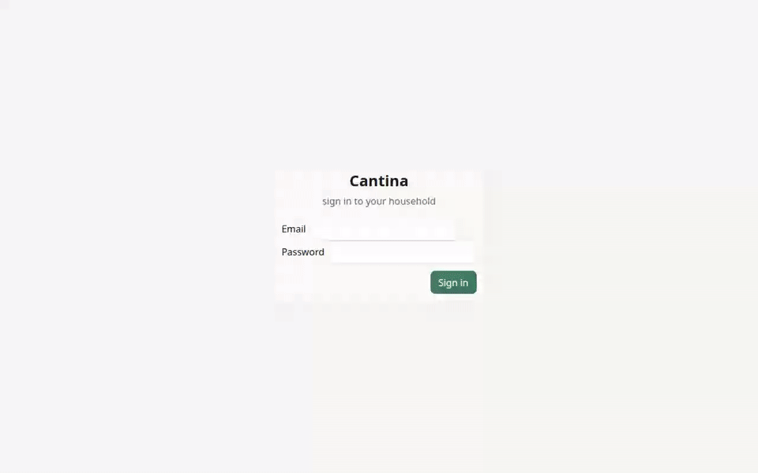
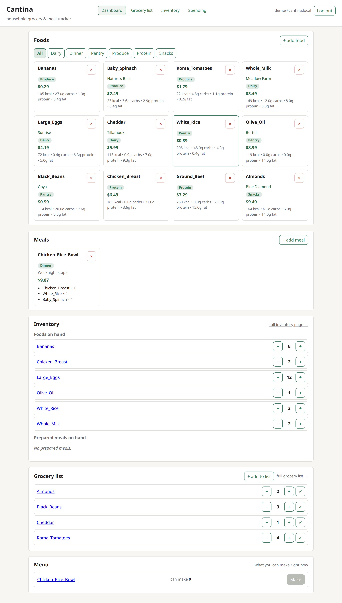
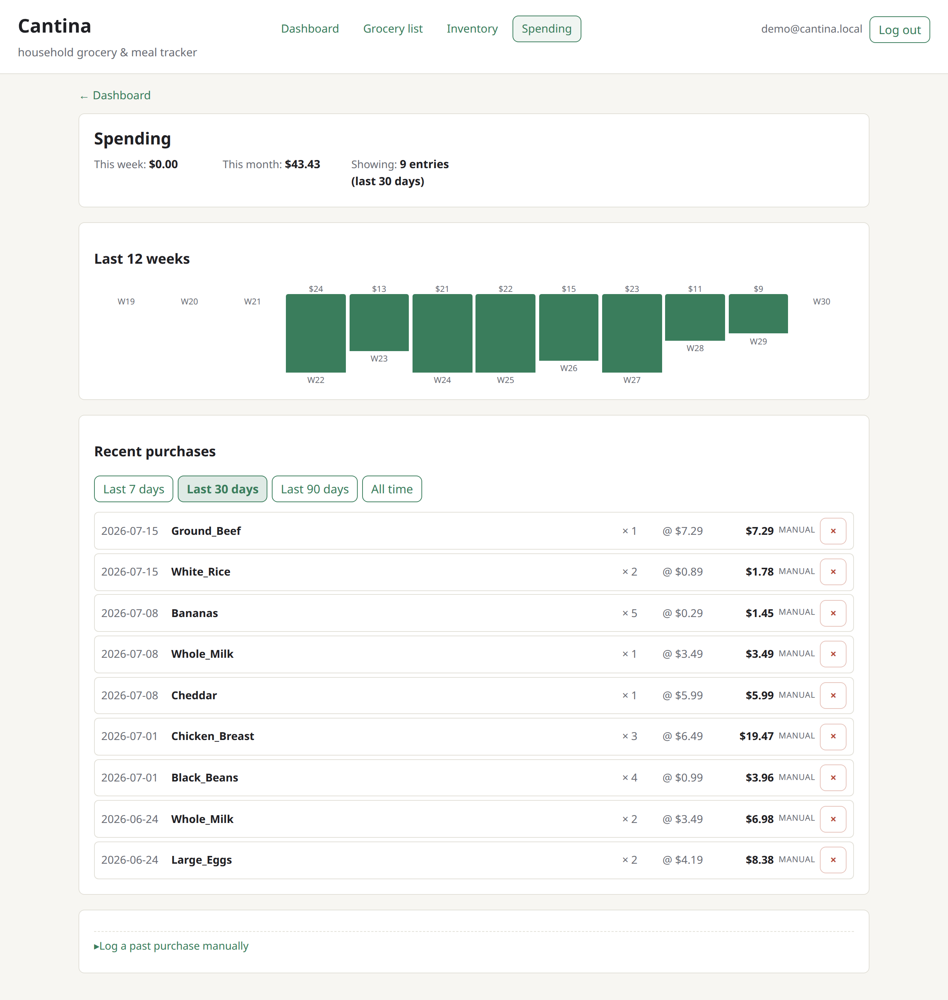

# 🥫 Cantina

[](https://cantina-demo.fly.dev)

A self-hosted **household grocery & meal tracker**: a food catalog with nutrition
and cost, meals built from those foods, on-hand inventory, a shared grocery list,
and a running record of what you spend. A small FastAPI backend serves a
dependency-free static frontend; data lives in SQLite.

- **Catalog** — foods with cost, calories, macros, brand and category; build
  **meals** from them, with a "what can I make right now?" menu driven by what's
  in stock.
- **Inventory & grocery list** — track quantities on hand, keep a shared list,
  and check items off (optionally straight into inventory and spending).
- **Spending** — every purchase recorded with weekly/monthly rollups.
- **Household accounts** — cookie sessions backed by opaque, DB-stored tokens
  (revocable; a stolen backup can't be replayed), an admin who can add members,
  CSRF protection, rate limiting, and Secure-cookie support behind a TLS proxy.

## Live demo

**[cantina-demo.fly.dev](https://cantina-demo.fly.dev)** — sign in as
`demo@cantina.local` / `demopass123`.

> The demo runs on a **fabricated dataset** — an invented family's groceries and
> spending, never real household data. The database is wiped and re-seeded on
> every restart, so poke at it freely; you can't break anything that won't fix
> itself. See [`backend/src/seed_demo.py`](backend/src/seed_demo.py).

## Walkthrough

<!-- Recorded to docs/video/walkthrough.gif — see "Public demo instance" below to
     (re)generate it. Once recorded, it embeds here: -->


About a minute, no narration: sign in → the dashboard (catalog, meals, and the
"what you can make right now" menu) → the **Spending** page with weeks of history
→ the grocery list → inventory. ([Higher-quality MP4](docs/video/walkthrough.mp4)
· recorded from the real app by
[`frontend/scripts/record-walkthrough.mjs`](frontend/scripts/record-walkthrough.mjs).)

## Screenshots

| Dashboard | Spending |
|---|---|
| [](docs/img/dashboard.png) | [](docs/img/spending.png) |

<!-- Capture these from the demo container at 1280×800; drop them in docs/img/. -->

## Run it locally

```bash
cd backend
python3 -m venv src/venv
src/venv/bin/pip install -r requirements.txt
# Keep data out of the source tree (survives git operations, easy to back up):
CANTINA_DATA_DIR=~/cantina-data src/venv/bin/python src/manage.py create-user \
    --email you@example.com --role admin
CANTINA_DATA_DIR=~/cantina-data src/venv/bin/uvicorn --app-dir src api:app --port 8000
# open http://localhost:8000
```

Config is all environment: `CANTINA_DATA_DIR` (where the DB lives),
`CANTINA_HOST`/`CANTINA_PORT`, and `CANTINA_SECURE_COOKIES`/`CANTINA_TRUSTED_PROXY`
once a TLS proxy fronts the app. See [`backend/src/config.py`](backend/src/config.py).

For an always-on self-hosted deployment (systemd + a cloudflared tunnel), see
**[DEPLOY.md](DEPLOY.md)**.

## Public demo instance

[`deploy/demo/`](deploy/demo) hosts a throwaway instance anyone can click around
in. It differs from the real deployment in three deliberate ways:

- **One container.** cantina's FastAPI app already serves the static frontend
  itself, so the demo is a single `uvicorn` process — no nginx, no build step
  (see [`deploy/demo/Dockerfile`](deploy/demo/Dockerfile)).
- **Ephemeral, self-resetting data.** No volume is mounted, and the entrypoint
  runs `seed_demo --force` on boot — so every restart (including a scale-to-zero
  cold start) repaints the same **fabricated** dataset. That *is* the reset
  mechanism, and the published login is throwaway by design.
- **Fabricated data only.** Real household groceries and spending never ship here.

```bash
# Build/run it locally exactly as the host will (context is the repo root):
docker build -f deploy/demo/Dockerfile -t cantina-demo .
docker run --rm -p 8000:8000 cantina-demo        # http://localhost:8000 — demo@cantina.local / demopass123

# Or ship it to Fly.io. `app`/PUBLIC_BASE_URL in fly.toml must be renamed first
# (the app name has to be globally unique across Fly):
fly apps create cantina-demo
fly deploy --config deploy/demo/fly.toml --dockerfile deploy/demo/Dockerfile .
fly scale count 1     # REQUIRED — the demo's SQLite DB is ephemeral & machine-local
```

Record the walkthrough (and screenshots) from that same container, so they can be
regenerated whenever the UI changes:

```bash
docker run -d --name cantina-demo-rec -p 3200:8000 cantina-demo
cd frontend && npm i -D @playwright/test && npx playwright install chromium
node scripts/record-walkthrough.mjs                   # -> docs/video/walkthrough.webm

# Convert to the MP4 + GIF the README embeds:
ffmpeg -y -i ../docs/video/walkthrough.webm -movflags +faststart -pix_fmt yuv420p ../docs/video/walkthrough.mp4
ffmpeg -y -i ../docs/video/walkthrough.webm \
  -vf "fps=12,scale=960:-1:flags=lanczos,split[s0][s1];[s0]palettegen[p];[s1][p]paletteuse" \
  ../docs/video/walkthrough.gif
```
